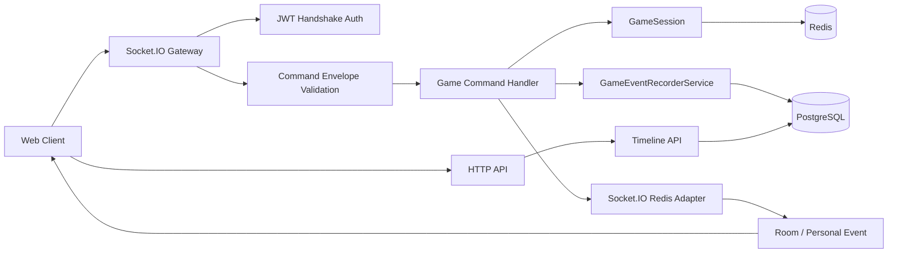

# Mafia Casefile

실시간으로 진행되는 마피아 게임에서 채팅, 투표, 역할 능력, 처형 결과를 사건 기록으로 남기고, 게임 종료 후 턴별 타임라인으로 복기할 수 있게 만든 WebSocket 기반 게임 서버 프로젝트입니다.

마피아 게임은 한 사용자의 행동이 같은 방의 여러 사용자에게 즉시 전달되고, phase와 역할에 따라 허용되는 행동이 달라집니다. 게임이 끝난 뒤에는 채팅, 투표, 역할 행동, 처형 결과를 순서대로 다시 볼 수 있어야 합니다.

---

## 실시간 게임으로 다룬 백엔드 문제

게임 한 판을 안정적으로 진행하기 위해 연결 상태, 실시간 broadcast, 역할별 권한, phase 전환, 중복 요청, 재접속, 영구 기록을 같은 흐름에서 처리했습니다.

주요 구현 주제는 다음과 같습니다.

* Socket.IO 기반 room broadcast와 개인 이벤트 전달
* JWT handshake 인증과 WebSocket 연결 권한 검증
* `WAITING -> NIGHT -> DAY_DISCUSSION -> VOTING -> RESULT -> NIGHT` phase 상태 머신
* phase, role, alive/dead 상태에 따른 command 권한 검증
* API 서버 멀티 인스턴스에서 Socket.IO room event를 전파하는 문제
* Redis와 PostgreSQL의 역할 분리
* `requestId` 기반 중복 요청 방지
* reconnect 이후 현재 게임 상태와 가능한 행동 복구
* 게임 종료 후 `GameEventLog` 기반 사건 타임라인 조회

---

## 해결한 문제

| 문제 | 선택한 해결 | 검증한 내용 |
| --- | --- | --- |
| Socket.IO broadcast가 단일 프로세스에 갇히는 문제 | Socket.IO Redis Adapter로 인스턴스 간 pub/sub 전파 | 서로 다른 API 인스턴스에 연결된 클라이언트가 같은 room event를 받는지 테스트 |
| 진행 중 게임 상태가 특정 API 메모리에 묶이는 문제 | GameSession, room, requestId, reconnect 상태를 Redis-backed 저장소로 분리 | Redis repository와 multi-instance 테스트 |
| 게임 행동 기록 규칙이 여러 command handler에 흩어지는 문제 | `GameEventRecorderService.recordEvent()`를 단일 기록 진입점으로 사용 | game event flow, recorder, timeline 테스트 |
| 타임라인 순서가 생성 시간에 흔들릴 수 있는 문제 | `gameId + seq`를 사건 정렬 기준으로 사용 | `seq` 오름차순 조회와 unique 제약 검증 |
| 더블 클릭이나 네트워크 재전송으로 command가 중복 반영되는 문제 | `requestId` 기반 idempotency registry 적용 | duplicate request 테스트 |
| 새로고침 이후 현재 phase와 가능한 행동을 잃는 문제 | reconnect snapshot과 `availableActions` 계산 | reconnect state, available actions 테스트 |
| UI 버튼 표시만으로 권한을 믿을 수 없는 문제 | 서버에서 phase, role, player status 기준으로 command 최종 검증 | game rules, socket command 테스트 |

---

## 멀티 인스턴스 문제 해결

단일 API 서버에서는 Socket.IO room broadcast가 같은 프로세스 안에서 끝납니다. 하지만 API 서버를 `api-1`, `api-2` 두 대로 나누면 다음 문제가 생깁니다.

```text
user A -> api-1 연결
user B -> api-2 연결

user A가 room event 발생
-> api-1 메모리 room에만 broadcast하면
-> api-2에 연결된 user B는 이벤트를 받지 못함
```

API 서버는 stateless한 command 처리 계층으로 두고, Redis를 인스턴스 간 공유 계층으로 사용했습니다.

* Socket.IO Redis Adapter로 한 인스턴스의 room broadcast를 다른 인스턴스의 socket에도 전달
* Redis room repository로 방 생성/참가 상태 공유
* Redis GameSession repository로 진행 중 게임 상태 공유
* Redis requestId registry로 중복 요청 처리 결과 공유
* Redis reconnect/connection state로 새로고침 이후 복구 정보 공유

멀티 인스턴스 검증은 아래 테스트로 관리합니다.

```bash
pnpm --filter api test:multi-instance
pnpm --filter api test:socket-redis-adapter
pnpm --filter api test:room-redis
```

---

## 인프라 아키텍처

프론트엔드는 Vercel에 배포하고, API와 인프라는 OCI Compute 위에 분리했습니다.

```text
Vercel Web
  |
  v
OCI api-1  1 OCPU / 6GB
OCI api-2  1 OCPU / 6GB
  |
  v
OCI infra  2 OCPU / 12GB
- PostgreSQL
- Redis
```

역할 분리는 다음과 같습니다.

| 구성 | 역할 |
| --- | --- |
| Vercel Web | 4인 데모 UI, Socket.IO client, 사건 타임라인 화면 |
| OCI api-1 / api-2 | NestJS HTTP API, Socket.IO Gateway, command 처리 |
| Redis | Socket.IO Adapter pub/sub, GameSession, room, requestId, reconnect 상태 |
| PostgreSQL | 사용자, 게임 결과, 플레이어 결과, `game_event_logs`, 신고 메시지 |

API 인스턴스는 특정 서버 메모리에 의존하지 않게 두고, 진행 중 상태는 Redis로, 영구 기록은 PostgreSQL로 분리했습니다.

---

## 사건 복기 설계

사건 복기는 게임 종료 후 채팅, 투표, 역할 행동, 처형 결과를 턴 순서대로 확인하는 기능입니다. Socket.IO broadcast용 이벤트와 복기용 영구 기록을 분리해 저장합니다.

그래서 채팅, 투표, 역할 행동, 처형, 사망, 게임 종료처럼 의미 있는 행동은 `GameEventRecorderService.recordEvent()`를 통해 `GameEventLog`에 저장합니다.

| Event type | 발생 시점 | 게임 중 공개 | 종료 후 공개 |
| --- | --- | --- | --- |
| `GameStarted` | 게임 시작 확정 | PUBLIC | PUBLIC |
| `RoleAssigned` | 역할 배정 | PRIVATE | PUBLIC |
| `PhaseChanged` | phase 전환 | PUBLIC | PUBLIC |
| `ChatMessageSent` | 채팅 확정 | PUBLIC / MAFIA_ONLY / GHOST_ONLY | PUBLIC |
| `MafiaTargetSelected` | 마피아 타깃 선택 | MAFIA_ONLY | PUBLIC |
| `DoctorTargetSelected` | 의사 보호 선택 | PRIVATE | PUBLIC |
| `PoliceInvestigated` | 경찰 조사 | PRIVATE | PUBLIC |
| `VoteCasted` | 투표 확정 | PUBLIC | PUBLIC |
| `PlayerExecuted` | 처형 확정 | PUBLIC | PUBLIC |
| `PlayerKilled` | 밤 사망 확정 | PUBLIC | PUBLIC |
| `GameFinished` | 게임 종료 | PUBLIC | PUBLIC |

타임라인은 `createdAt`이 아니라 `gameId + seq` 기준으로 정렬합니다. 실시간 서버에서는 기록 시각보다 게임 안에서 확정된 순서가 복기 기준에 더 중요하기 때문입니다.

```http
GET /games/:gameId/timeline
```

기본 응답은 `visibilityAfterGame = PUBLIC`인 사건만 `seq` 오름차순으로 반환합니다.

---

## 처리 흐름



기본 command 처리 흐름은 다음과 같습니다.

```text
Client command
-> Socket.IO Gateway
-> command envelope validation
-> game command handling
-> GameSession mutation
-> GameEventRecorderService.recordEvent()
-> Socket.IO event broadcast
```

---

## 범위

현재 프로젝트는 MVP 게임 한 판을 브라우저에서 시연하고, 핵심 사건을 타임라인으로 확인하는 흐름에 초점을 맞춥니다.

포함한 범위는 다음과 같습니다.

* 회원가입, 로그인, JWT 발급
* WebSocket JWT handshake 인증
* 방 생성, 참가, 나가기, 준비 상태 변경
* 4인 기준 역할 배정
* 밤, 낮 토론, 투표, 결과 phase 흐름
* 마피아 공격, 의사 보호, 경찰 조사
* 낮 채팅, 마피아 채팅, 유령 채팅
* 투표, 처형, 밤 사망, 승리 조건 처리
* 주요 게임 행동의 `GameEventLog` 기록
* 게임 종료 후 사건 타임라인 조회
* requestId 기반 중복 요청 방지
* reconnect snapshot과 availableActions 계산
* Socket.IO Redis Adapter 기반 다중 API 인스턴스 전파 검증

아직 운영 서비스 전체 범위로 포함하지 않은 항목은 다음과 같습니다.

* 공개 서비스용 사용자 매칭과 방 검색 UX
* 관리자 도구
* 신고 처리 백오피스
* 운영 모니터링 대시보드 전체 구성
* 대규모 부하 테스트 결과 수치 정리

---

## 기술 스택

| 분류 | 기술 |
| --- | --- |
| Backend | NestJS, TypeScript, Socket.IO |
| Frontend | Next.js, TypeScript, Socket.IO Client |
| Database | PostgreSQL, Prisma |
| Realtime State | Redis |
| Auth | JWT |
| Test | node:test, Socket.IO Client test, Docker Compose |
| Deployment | Vercel, OCI Compute, GitHub Actions, GHCR, Docker Compose |

---

## Demo UI

`apps/web`에는 브라우저에서 실제로 4명이 한 판을 진행할 수 있는 최소 UI가 있습니다.

* Vercel Frontend URL: https://mafia-casefile-web.vercel.app/play
* Local Frontend URL: http://localhost:3000/play
* Local API URL: http://localhost:3001

### 실행

1. 로컬 인프라를 실행합니다.
   - `docker compose up -d`
1. 의존성을 설치합니다.
   - `pnpm install`
1. API를 실행합니다.
   - `pnpm --filter api start:dev`
1. Web을 실행합니다.
   - `pnpm --filter web dev`
1. 브라우저에서 `http://localhost:3000/play`를 엽니다.

### 4인 데모 절차

1. 각 브라우저에서 서로 다른 `userId`, `email`, `nickname`을 입력합니다.
1. `토큰 발급`을 눌러 로컬 데모용 JWT를 만듭니다.
1. 각 브라우저에서 `소켓 연결`을 누릅니다.
1. 호스트가 `방 생성`을 누르면 host socket은 자동으로 방에 참가합니다.
   - 자동 참가 실패 시 호스트도 `방 참가` 버튼을 누릅니다.
1. 나머지 3명이 `roomId`를 입력하고 `방 참가`를 누릅니다.
1. 전원이 `Ready 토글`을 눌러 준비를 마칩니다.
1. 호스트가 `게임 시작`을 누릅니다.
1. 낮 채팅, 밤 액션, 투표를 진행합니다.
1. 게임이 끝나면 `/games/{roomId}/timeline` 링크로 결과 타임라인을 확인합니다.

### 참고

* `POST /api/demo-token`은 로컬 데모용입니다.
* UI의 availableActions는 reconnect snapshot 또는 client-side phase/role/status 계산을 기준으로 버튼을 표시하며, 실제 권한은 서버 command 검증이 최종 기준입니다.
* 스크린샷과 GIF 정리는 다음 작업-045에서 진행합니다.

---

## 주요 검증 명령

```bash
pnpm --filter api test:game-event-flow
pnpm --filter api test:game-event-recorder
pnpm --filter api test:game-event-timeline
pnpm --filter api test:reconnect-idempotency-lock
pnpm --filter api test:request-idempotency
pnpm --filter api test:multi-instance
pnpm --filter api test:socket-redis-adapter
pnpm lint
pnpm build
```

---

## 주요 문서

```text
docs/
├── AUTH.md
├── API.md
├── DB_SCHEMA.md
├── EVENT_CATALOG.md
├── GAME_RULES.md
├── GAME_SESSION.md
├── REDIS_KEYS.md
├── RECONNECT.md
├── SOCKET_PROTOCOL.md
└── adr/
```

* 프로젝트 기준: `PROJECT_SSOT.md`
* 구현 계획: `IMPLEMENTATION_PLAN.md`
* Socket.IO 계약: `docs/SOCKET_PROTOCOL.md`
* 사건 기록 카탈로그: `docs/EVENT_CATALOG.md`
* GameSession 구조: `docs/GAME_SESSION.md`
* Redis key 정책: `docs/REDIS_KEYS.md`
* 배포 메모: `docs/DEPLOYMENT.md`

---

## Deployment overview

프론트엔드는 Vercel에서 배포합니다.

* Frontend: https://mafia-casefile-web.vercel.app/play

API CI/CD는 GitHub Actions에서 API Docker image를 GHCR에 push한 뒤 OCI `api-1`/`api-2` 서버에 SSH로 순차 배포합니다. `api-1`, `api-2`는 각각 1 OCPU / 6GB 인스턴스이고, PostgreSQL과 Redis는 2 OCPU / 12GB `infra` 인스턴스에서 실행합니다.

API CD는 api-1 배포 단계에서 Prisma migration을 1회 실행한 뒤 api-1, api-2를 순차 배포합니다.

---

## 해석 기준

* 이 README는 현재 구현된 포트폴리오 데모 범위를 기준으로 정리했습니다.
* `GameEventLog`는 영구 사건 기록의 기준이며, Redis와 Socket.IO 이벤트는 게임 진행과 전달을 위한 경로입니다.
* 4인 데모 UI는 로컬 검증과 시연을 위한 최소 클라이언트입니다.
* 운영용 성능 수치와 스크린샷/GIF는 별도 작업에서 추가될 예정입니다.
